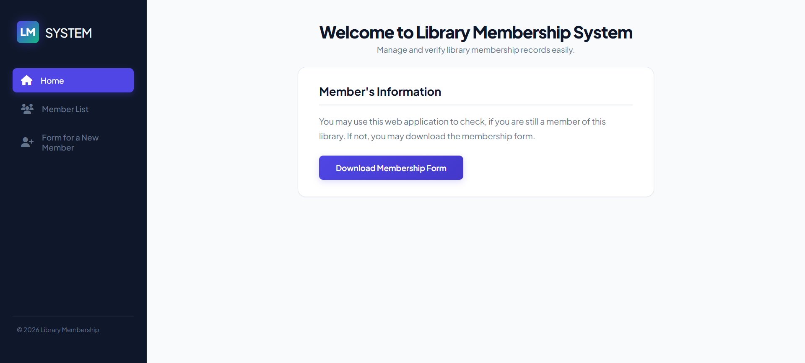
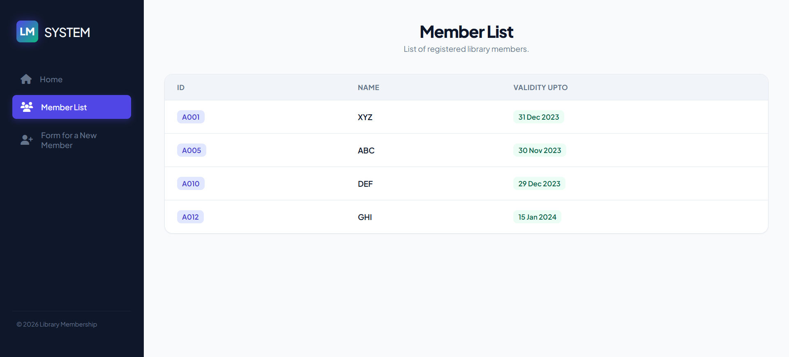
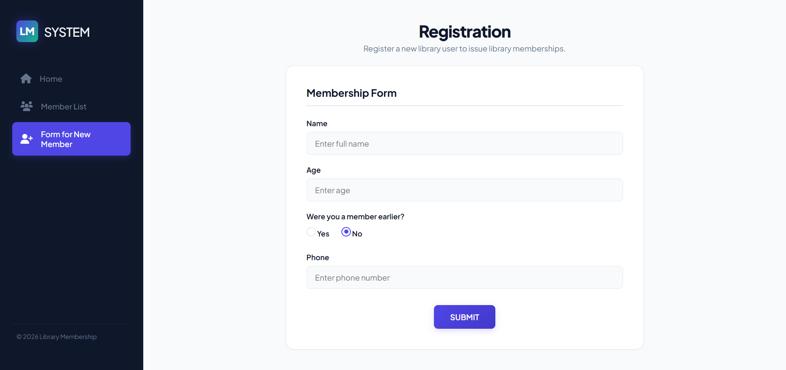

# 📚 Library Membership System

> A Java web application for managing and verifying library memberships — built with JSP, JDBC, MySQL, and Apache Tomcat.

---

## 🖥️ Project Overview

The **Library Membership System** is a college assignment project (IGNOU BCSL-057, Set-IV) that demonstrates a three-page web application using Java Server Pages and MySQL database connectivity.

Users can:
- View the home page with library information
- Browse a live list of registered members fetched from MySQL
- Fill out a membership registration form

---

## 📸 Screenshots

### Home Page


### Member List


### New Member Form


---

## 📄 Pages

| Page | File | Description |
|---|---|---|
| Home | `home.jsp` | Welcome page with member information panel |
| Member List | `member-list.jsp` | Live member data fetched from MySQL via JDBC |
| New Member Form | `new-member.jsp` | Registration form for new members |

---

## 🛠️ Tech Stack

| Technology | Purpose |
|---|---|
| HTML5 | Page structure |
| CSS3 (External) | Styling — `css/style.css` |
| JSP (Java Server Pages) | Server-side dynamic pages |
| JDBC | Java to MySQL database connectivity |
| MySQL | Database — stores member records |
| Apache Tomcat 9 | Web server — runs the JSP application |
| NetBeans IDE | Development environment |
| XAMPP | Local MySQL server |
| Font Awesome 6 | Icons in sidebar navigation |
| Plus Jakarta Sans | Typography (Google Fonts) |

---

## 📁 Project Structure

```
LibraryMembershipSystem/
│
├── web/                        ← All files served to the browser
│   ├── index.html              ← Redirects to home.jsp
│   ├── home.jsp                ← Home / Welcome page
│   ├── member-list.jsp         ← Member list with JDBC database query
│   ├── new-member.jsp          ← New member registration form
│   │
│   ├── css/
│   │   └── style.css           ← External CSS for all 3 pages
│   │
│   └── WEB-INF/
│       └── web.xml             ← Tomcat configuration (welcome file)
│
├── src/                        ← Java source folder (NetBeans)
├── nbproject/                  ← NetBeans project configuration
├── screenshots/                ← Project screenshots
├── schema.sql                  ← Database setup script
├── build.xml                   ← Apache Ant build file
└── README.md                   ← This file
```

---

## ⚙️ Setup & Installation

### Prerequisites

Make sure you have all of these installed:

- JDK 11 or above
- Apache Tomcat 9
- NetBeans IDE
- XAMPP (for MySQL)
- MySQL Connector/J JAR (JDBC driver)

---

### Step 1 — Clone the Repository

```bash
git clone https://github.com/itsSubhojit/Library-Membership-System-JSP-College-Project-.git
```

---

### Step 2 — Setup the Database

1. Open **XAMPP Control Panel** and start **MySQL**
2. Open browser → go to `http://localhost/phpmyadmin`
3. Click the **SQL** tab
4. Copy and paste the contents of `schema.sql` and click **Go**

---

### Step 3 — Add JDBC Driver to Project

1. Download **MySQL Connector/J** JAR from [mysql.com](https://dev.mysql.com/downloads/connector/j/)
2. In NetBeans → right-click **Libraries** → **Add JAR/Folder**
3. Select the `mysql-connector-j-x.x.x.jar` file
4. Also copy the same JAR into:
```
[Tomcat installation folder]/lib/
```

---

### Step 4 — Open Project in NetBeans

1. Open NetBeans
2. **File → Open Project**
3. Navigate to the cloned folder and open it

---

### Step 5 — Verify Database Credentials

Open `web/member-list.jsp` and check these lines:

```java
conn = DriverManager.getConnection(
    "jdbc:mysql://localhost:3306/members?useSSL=false&allowPublicKeyRetrieval=true&serverTimezone=UTC",
    "root",   // ← MySQL username
    ""        // ← MySQL password (empty by default in XAMPP)
);
```

If you set a MySQL password in XAMPP, enter it in the empty string above.

---

### Step 6 — Run the Project

1. Make sure **XAMPP MySQL is running**
2. In NetBeans → right-click project → **Run**
3. Tomcat starts automatically
4. Browser opens at:

```
http://localhost:8080/LIbrary-Membership-System/
```

---

## 🔄 How It Works

```
User opens browser
        ↓
index.html loads → redirects to home.jsp
        ↓
User sees Home page with sidebar navigation
        ↓
User clicks "Member List"
        ↓
member-list.jsp runs on Tomcat server
        ↓
JDBC loads MySQL driver → connects to database
        ↓
SELECT query fetches all rows from memberlist table
        ↓
JSP loops through ResultSet → builds HTML table
        ↓
Browser displays member table with ID, Name, Validity date
        ↓
User clicks "Form for a New Member"
        ↓
new-member.jsp shows registration form
        ↓
User fills form → clicks Submit → redirects to home.jsp
```

---


## ⚠️ Common Errors & Fixes

| Error | Cause | Fix |
|---|---|---|
| `ClassNotFoundException` | JDBC JAR not added | Add `mysql-connector-j.jar` to Libraries and Tomcat `/lib` |
| `Communications link failure` | MySQL not running | Start MySQL in XAMPP Control Panel |
| `Access denied for user 'root'` | Wrong password | Check password in `member-list.jsp` |
| `Unknown database 'members'` | Database not created | Run `schema.sql` in phpMyAdmin |
| `404 Not Found` | Wrong file location | Check files are inside `web/` folder |
| CSS not loading | Wrong path | Confirm `href="css/style.css"` and folder exists |

---

## 👨‍💻 Author

**Csubhojit**  


---


*Built with Java, JSP, and MySQL*